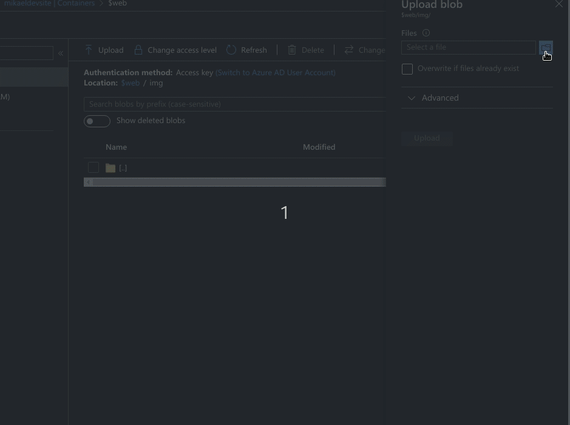

# Azure Web Image Dwnszr

Why another Serverless Image Resizer®? While writing a few static websites, I could not find any existing solution that met my requirements around image management. I need something that:
- ⬇ Downsizes copies of images on upload and stores them (storage vs compute)
- 🔵 Also outputs in WEBP image files for Chrome
- 🗃 Creates metadata for consumption by static website generators
- 💰 Cost-effective for smaller sites (pay as you go vs tiers)

Enter *Azure Image Web Dwnszr* which is an opinionated solution to my requirements!

## Deploying

A sample deployment script has been included ([sample-deployment.sh](./sample-deployment.sh)) in this repository. Ensure you have a `.env` file configured (in the same format as `.env.sample`), the [Azure CLI](https://docs.microsoft.com/en-us/cli/azure/install-azure-cli?view=azure-cli-latest) installed, an Azure subscription to deploy to, and execute the commands in that script.

## Contributing

Look at [DEVELOPERS.md](./DEVELOPERS.md) for information around developing locally, tests, and debugging
